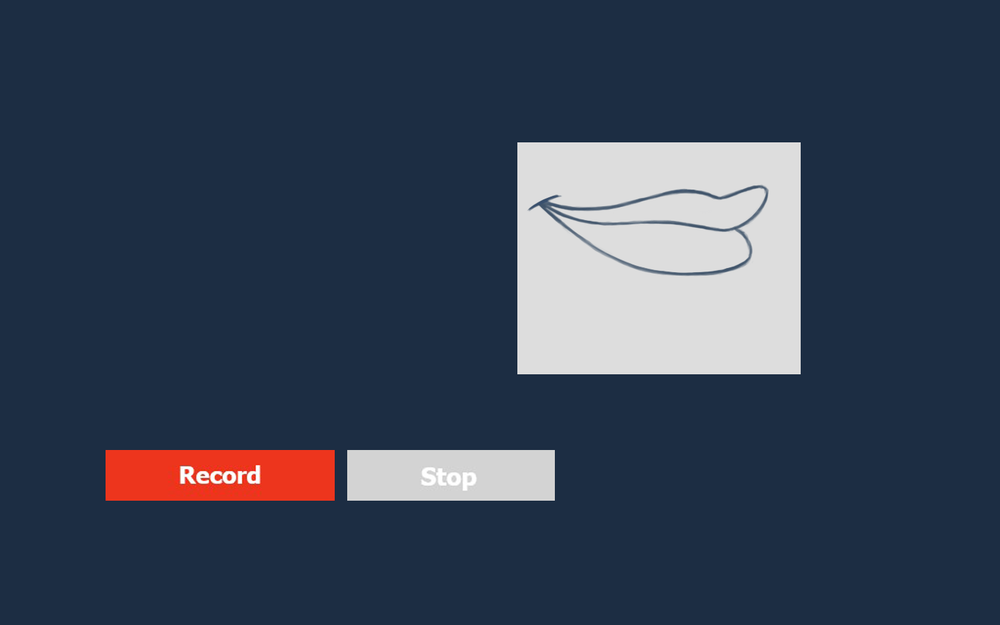
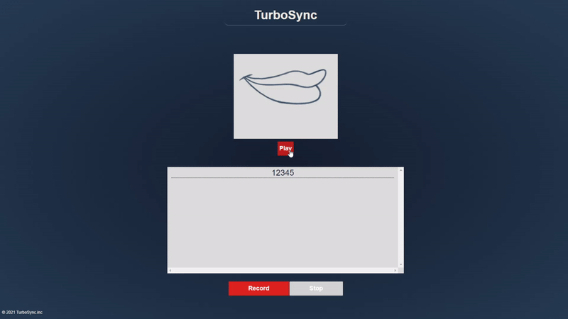

<!-- PROJECT LOGO -->
 

  
  <h1 align="center">TurboSync</h1>

  <h3 align="center">
    A Lip Syncing Web App
     
  </h3>

<!-- TABLE OF CONTENTS -->

  
Table of Contents

  <ol>
    <li>
      <a href="#about-the-project">About The Project</a>
      <ul>
        <li><a href="#built-with">Built With</a></li>
      </ul>
    </li>
    <li><a href="#usage">Usage</a></li>
    <li><a href="#license">License</a></li>
    <li><a href="#acknowledgments">Acknowledgments</a></li>
  </ol>

<!-- ABOUT THE PROJECT -->
## About The Project

This project was created with the aim of producing an application which can take in the user’s microphone and from that audio produce an animation of lips moving.

The main focus of the project is ensuring that the lip animation doesn’t statically open and close with audio but instead are phonetically accurate. The lips should move in a way so that someone reading the lips would understand what was said.

(<a href="#top">back to top</a>)

### Built With

* [PHP](https://www.php.net/)
* [JavaScript](https://www.javascript.com/)
* [Bootstrap](https://getbootstrap.com)
* [JQuery](https://jquery.com)

(<a href="#top">back to top</a>)

<!-- USAGE EXAMPLES -->
## Usage

To use the app you first have to ensure two things:
1. The app is currently only compatable with google chrome so you will need to use that as your browser. 
2. You must have your mic connected on page load for the app to work correctly.

To begin recording just press the record button and allow the app to use your mic. When done, stop the recording and the lips will animate.

(<a href="#top">back to top</a>)

<!-- LICENSE -->
## License

Distributed under the MIT License.

(<a href="#top">back to top</a>)

<!-- ACKNOWLEDGMENTS -->
## Acknowledgments

* [Rhubarb](https://github.com/DanielSWolf/rhubarb-lip-sync)
* [RPuffers API](https://github.com/RPuffer/lip-sync-api)

(<a href="#top">back to top</a>)

